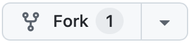
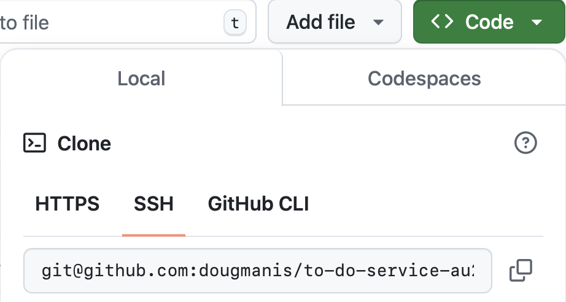

# Install Flexigift

The Flexigift service can run in the cloud, but code samples and tutorials in API documents assume 
you are running Flexigift from you local workstation.

## Prerequisites

The Flexigift service requires the following utilities:

* A [GitHub account](https://github.com)
* Access to the [Flexigift repo](https://github.com/dougmanis/flexigift-service)
* [Git](https://docs.github.com/en/get-started/quickstart/set-up-git) (for the command line)
* A current/LTS version of [node.js](https://nodejs.org/en)
* A current version of [json-server](https://www.npmjs.com/package/json-server)
* The [Postman desktop app](https://www.postman.com/downloads)

## Set up Flexigift on your local computer

### 1) Fork the Flexigift GitHub repo

1. Log in to the [Flexigift GitHub repo](https://github.com/dougmanis/flexigift-service).

1. Click Fork in the upper-right portion of the screen:    

    

1. From your GitHub fork, copy the repo's SSH URL to your clipboard:    

    

### 2) Create and checkout a test branch on your PC

1. In a terminal on your computer, change to your Git working folder. ex:

    ```shell
    cd ~/githome
    ```

1. Clone your fork of the Flexigift repo. ex:

    ```shell
    git clone git@github.com:<your-git-account>/flexigift-service.git
    ```

1. Move to your new Flexigift directory. ex:

    ```shell
    cd flexigift-service
    ```

1. Create and check out a test branch. ex:

    ```shell
    git checkout -b flexigift-test
    ```

### 3) Test your Flexigift instance

1. Test your Flexigift instance:

    ```shell
    cd api
    json-server -w Flexigift.json
    ```

    If your system is set up properly, Flexigift starts up. ex:

    ```shell
        \{^_^}/ hi!

    Loading Flexigift.json
    Done

    Resources
    http://localhost:3000/users
    http://localhost:3000/gift_cards
    http://localhost:3000/products
    http://localhost:3000/transactions

    Home
    http://localhost:3000
    ```

    > **Note**: Leave the Flexigift console open! Keep this window open to run Flexigift and open 
    another window to make API calls.

1. Open a new console window and make a test call to the service. ex:

    ```shell
    curl http://localhost:3000/users
    ```

1. If the service is running correctly, you will see a list of users from the service. ex:

    ```json
    [
        {
            "id": 1,
            "user_id": "user001",
            "amazon_id": "amz12345",
            "name": "John Doe",
            "email": "john.doe@example.com",
            "gift_cards": [
            "hanes-gc-001",
            "nike-gc-002"
            ]
        },
        {
            "id": 2,
            "user_id": "user002",
            "amazon_id": "amz67890",
            "name": "Jane Smith",
            "email": "jane.smith@example.com",
            "gift_cards": [
            "starbucks-gc-003"
            ]
        },
        {
            "id": 3,
            "user_id": "user003",
            "amazon_id": "amz54321",
            "name": "Alice Johnson",
            "email": "alice.johnson@example.com",
            "gift_cards": [
            "gap-gc-004",
            "nike-gc-002"
            ]
        },
        {
            "id": 4,
            "user_id": "user004",
            "amazon_id": "amz98765",
            "name": "Bob Brown",
            "email": "bob.brown@example.com",
            "gift_cards": [
            "hanes-gc-001"
            ]
        }
    ]
    ```

## Troubleshooting

If you don't see the list of users, or receive an error in any step of the procedure, 
investigate and correct the error before continuing.

Some common situations that cause errors include:

* You mistyped a command.
* You aren't in the correct directory.
* A required software component didn't install correctly.
* A required software component isn't up to date.

## Next steps

If you see the list of users from the service, congratulations! You are ready to use Flexigift. 
Start with the following links:

* [Documentation home](index.md)
* [Install Flexigift](setup.md)
* [Tutorials](tutorials/index.md)
* [API reference](api/index.md)
* [Support](mailto:support@example.com)